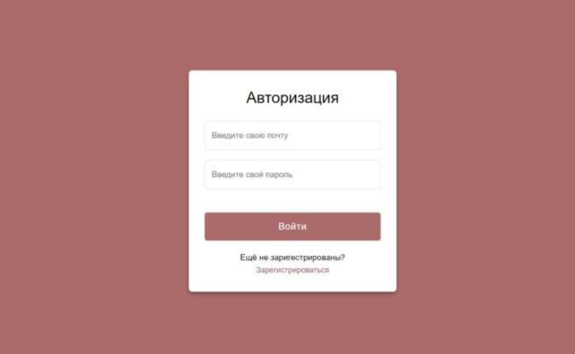
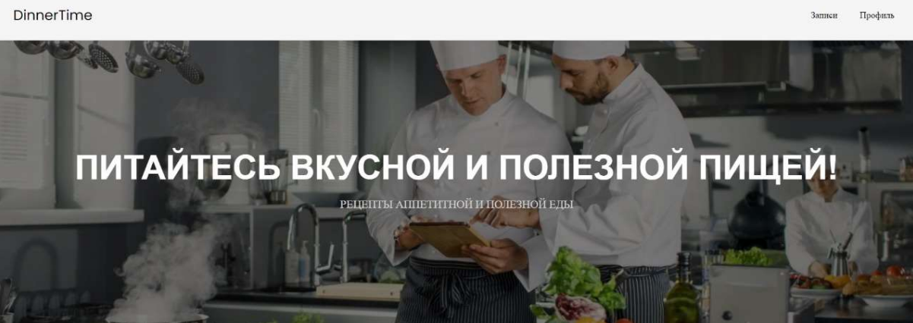
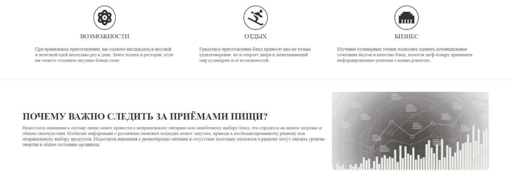
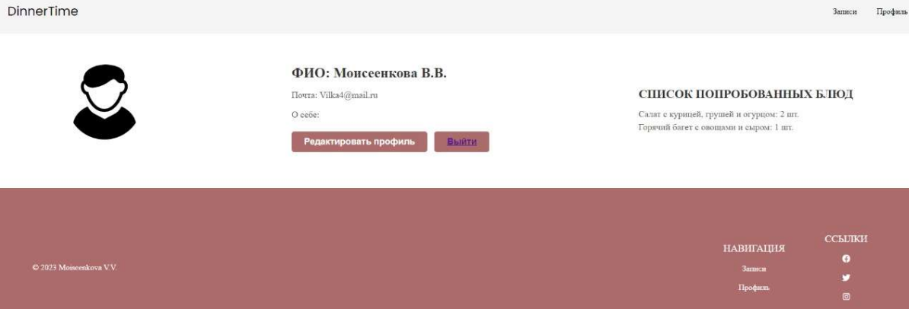
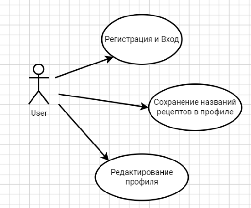
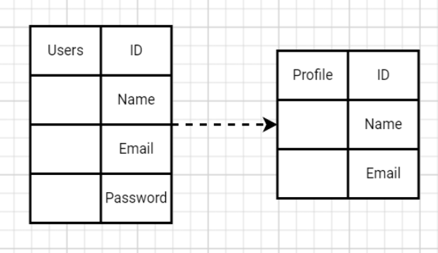

1. Backend - Go (возможно изменится на Node.js)
2. Frontend - HTML/CSS (возможно добавится JS с React)
3. БД - PostgreSQL

!ВНЕШНЕ САЙТ МОЖЕТ СИЛЬНО ИЗМЕНИТЬСЯ!

1. Первым делом нас встречает Авторизация. Здесь мы можем либо войти, если у нас есть профиль,либо зарегистрироваться, если его нет. 

2. Зайдя на сайт мы видим шапку, где можно перейти в записи или профиль.Под шапкой нас встречает баннер.

3. Ниже представлено краткое описание сайта и зачем он нужен

4. В самом низу можно увидеть подвал сайта. Здесь есть навигация и ссылки на соц.сети. 

5. Перейдя в записи мы попадаем к рецептам, здесь мы можем не только посмотреть их, но и записать к себе в профиль!

6. А перейдя в профиль увидим краткую информацию о нас. Фио и почту  — изменить нельзя, эта информация у нас остается с регистрации. А вот информацию о себе — можно. Справа мы видим все записанные рецепты, которые мы уже попробовали! Также можем заметить кнопку выйти, с помощью нее мы можем выйти из профиля и нам вновь придется авторизоваться или регистрироваться

Use case:

Здесь представлены основные моменты работы пользователя на сайте, а именно: 

1. Пользователь может зарегистрироваться или авторизоваться
2. Пользователь может записывать рецепты к себе в профиль
3. Пользователь может редактировать профиль

Такие действия, как просмотр страничек на сайте - не указаны. 

ERD:

Здесь представлены примерные структуры таблиц для БД. 

